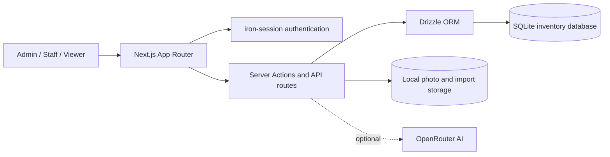

<div align="center">

# Kurikara Assets

**A visual, secure inventory platform for the Kurikaralanka campus.**

Manage rooms, assets, condition, photos, QR labels, imports, and audit history from one operational workspace.

[](https://nextjs.org/)
[](https://react.dev/)
[](https://www.typescriptlang.org/)
[](https://orm.drizzle.team/)
[](https://vitest.dev/)

<!-- GPRM-inspired README components / https://gprm.itsvg.in/ -->
[](https://gprm.itsvg.in/)

</div>

## What this system does

Kurikara Assets turns a conventional inventory register into an interactive campus map. Staff can locate equipment visually, update condition in place, attach evidence, print QR labels, and move data between the application and Excel without losing an audit trail.

### Core capabilities

| Area | Capability |
|---|---|
| Visual operations | Interactive two-floor plan with room health indicators and item drawers |
| Layout design | Drag, resize, rotate, recolor, and create rectangle, circle, or L-shaped rooms |
| Inventory | Role-aware create, update, soft-delete, condition toggles, photos, and audit events |
| Discovery | Global `Ctrl/Cmd + K` search across items, locations, and categories |
| Reporting | Dashboard metrics, condition analysis, Excel exports, and printable reports |
| Data exchange | Four-way Excel import review: new, changed, unchanged, and orphaned rows |
| QR workflow | Unique asset labels, room QR pages, printable grids, and scan-to-record navigation |
| Access control | Sealed-cookie sessions with `admin`, `staff`, and `viewer` permissions |
| AI assistance | Optional OpenRouter-powered inventory search and photo categorization |

## Architecture



## Technology

<div align="center">

[](https://skillicons.dev)

</div>

- Next.js 15 and React 19
- TypeScript, Tailwind CSS, Zustand, and shadcn-style UI primitives
- SQLite with Drizzle ORM and generated migrations
- iron-session, bcrypt, ExcelJS, QRCode, and html5-qrcode
- Vitest and Testing Library
- Docker and Fly.io deployment assets

## Quick start

### Requirements

- Node.js 20+
- pnpm

```bash
pnpm install
cp .env.example .env.local
```

Set a unique session secret and seed password in `.env.local`:

```env
SESSION_PASSWORD=<generate-a-random-32-plus-character-secret>
SEED_ADMIN_EMAIL=admin@example.com
SEED_ADMIN_PASSWORD=<choose-a-unique-12-plus-character-password>
```

Then initialize and run the application:

```bash
pnpm db:migrate
pnpm db:seed
pnpm dev
```

Open [http://localhost:3010](http://localhost:3010). The seed command creates the administrator account from the environment values above; the repository does not ship a default password.

## Commands

| Command | Purpose |
|---|---|
| `pnpm dev` | Run the development server on port 3010 |
| `pnpm build` | Create a production build |
| `pnpm start` | Serve the production build |
| `pnpm typecheck` | Run TypeScript without emitting files |
| `pnpm test` | Run the Vitest suite |
| `pnpm db:generate` | Generate Drizzle migration SQL |
| `pnpm db:migrate` | Apply pending SQLite migrations |
| `pnpm db:seed` | Import fixtures and create the configured administrator |

## Access model

| Role | Access |
|---|---|
| `admin` | Full inventory, user administration, deletes, and floor layout design |
| `staff` | Add and edit assets, photos, imports, and condition updates |
| `viewer` | Read-only inventory and reporting access |

## Project map

```text
src/
|- app/                  Next.js routes, API endpoints, auth, QR and reports
|- components/           Floor plan, designer, inventory, search and UI modules
|- lib/
|  |- actions/           Server-side mutations
|  |- auth/              Sessions and login flow
|  |- db/                Drizzle client and schema
|  |- excel/             Import parser and normalizer
|  `- queries/           Dashboard and inventory reads
|- stores/               Zustand designer state
`- middleware.ts         Authentication gate

drizzle/                 Versioned database migrations
scripts/                 Migration, seed, password and operations tools
tests/                   Vitest suites and import fixtures
data/                    Local runtime database, photos and imports (ignored)
```

## Security

- Never commit `.env`, `.env.local`, SQLite databases, uploads, or exports.
- Generate a distinct `SESSION_PASSWORD` for every environment.
- Seed credentials are mandatory; there is no well-known fallback password.
- Run the application behind HTTPS and rotate credentials after suspected exposure.
- Back up the ignored `data/` directory using encrypted, access-controlled storage.

## Deployment

The system expects persistent storage for `data/kurikara.db` and `data/photos/`. Use a single writable host or attach a persistent volume, terminate TLS at the proxy/platform, and set all values from `.env.example` through the platform secret manager.

See [`DEPLOY.md`](DEPLOY.md) for the Fly.io production workflow.

## Maintainer activity

<!-- GPRM-generated GitHub component -->
<div align="center">
  
</div>
